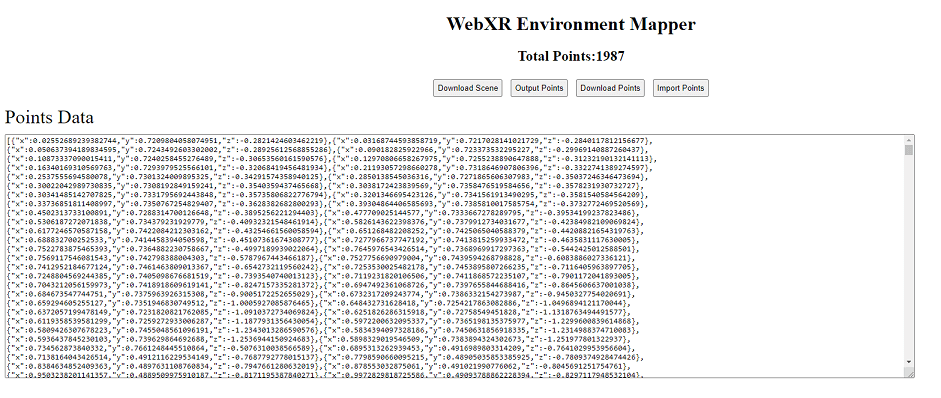
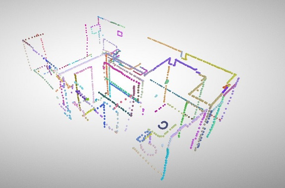

# WebXR Environment Mapper

## Create a model of your playspace/home using WebXR

[Glitch Demo](https://glitch.com/edit/#!/webxr-environment-mapper)

### Usage

**Note:** This tool works best with a wireless device like the Oculus Quest using [Virtual Desktop](https://www.vrdesktop.net/) or [ALVR](https://github.com/JackD83/ALVR/) and the guardian walls disabled.

If you are using a tethered device your model will be limited to the area within the reach of your cable.

**Always exercise caution and make sure your floors are clear of any obstacles and hazards before attempting to map an environment!**

Load the page in a [WebXR compatible browser](https://caniuse.com/#feat=webxr).

Put on your device and center your playspace at a point and rotation that is easily repeatable. This will become the origin point (0,0,0) for your model.

Using the right controller with the trigger held, trace your hand along the corners and edges of any walls and surfaces you want to be visible in the model.

When the trigger is held a cube will be created at the controllers position at a rate of 4 cubes per second.

This allows you to make slow movements to get solid lines, or fast movements to cover a large area faster.

The cubes will change colors in-between each release and press of the trigger.

Once you have walked around your environment and mapped all of the points you want in your final model, you can move to the browser interface.

The browser interace is comprised of the following elements:

* Download Scene - Exports a GLTF model of all of the points in the current scene.
* Ouput Points - Exports the coordinates for all of the generated cubes and puts the text output in the textarea below the buttons.
* Download Points - Exports the collection of cube coordinates to a text file.
* Import Points - Copy and paste a previously exported set of points into the textarea and click this button to recreate them in the current scene. This allows you to stop and resume mapping later. Note that the playspace center should not change between exporting and importing or the alignments will be off.

Take your GLTF model into your favorite 3D modelling software and replace the cube outline with walls and furniture.

There is a simple WebXR ready model loader example included in `test/`, simply replace the value of `modelFile` in `test/script.js` with the path to your own model file.

### TODO

* Implement a way to reset the world orientation around a static reference point. In my current testing my model assumes the playspace is centered at a specific position and rotation (sitting at my desk facing my monitor).
* Implement a better way of mapping walls. We can assume 99% of walls are vertically leveled planes. Allow the user to mark 4 points and fill with a wall or other object type.

### Credit

This is a WebXR implementation of the technique devised by [Emanuel Tomozei](https://twitter.com/eman_insilico/status/1246428908356079616), as described in [this article](https://emanueltomozei.wordpress.com/2020/04/14/tutorial-how-to-map-a-vr-environment-to-your-home/).
